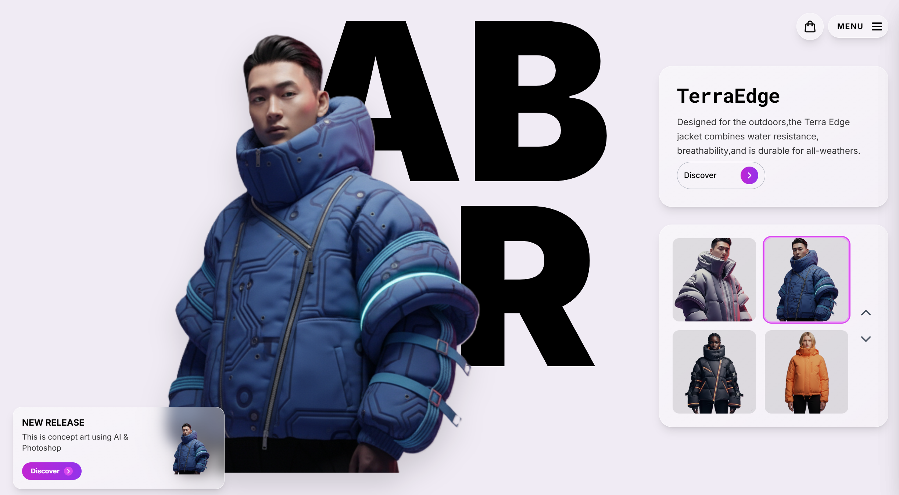

# neww vestes - A Futuristic Fashion Showcase

A concept e-commerce application showcasing futuristic, AI-inspired apparel. This project demonstrates a modern, clean UI built with React, TypeScript, and Tailwind CSS, featuring a "frosted glass" aesthetic, smooth animations, and a fully functional shopping cart experience.





## ✨ Features

- **Dynamic Product Showcase:** An interactive main page to browse featured products.
- **Smooth Animations & Transitions:** Fluid animations are applied across the application, including staggered "waterfall" effects for list items, cinematic page transitions, and tactile hover effects on all interactive elements.
- **Multiple Page Views:** Seamless navigation between the main showcase, a "Latest Drops" collection, and detailed product pages.
- **Interactive Product Options:** Users can select different colors and sizes for each item.
- **Dynamic Image Updates:** The main product image updates in real-time to reflect the selected color variant.
- **Fully Functional Shopping Cart:**
  - Add items to the cart from any detail page.
  - View items in a slide-out cart panel.
  - Update item quantities or remove them completely.
  - Live subtotal calculation.
- **Slide-Out Navigation Menu:** A clean, animated menu for site navigation.
- **Responsive Design:** The layout is optimized for a seamless experience on both desktop and mobile devices.

## 🛠️ Tech Stack

- **Frontend:** React, TypeScript
- **Styling:** Tailwind CSS for utility-first styling and custom animations.
- **Build Tool:** Vite (inferred from the project setup)


## ⚠️ Disclaimer

**This is a portfolio project and not a real e-commerce store.** The products are not for sale, and the checkout process is not functional. This project was created for demonstration purposes to showcase frontend development and UI/UX design skills.

## 🚀 Running the Project

To run this project locally:

1.  Clone the repository.
     ```bash
    git clone https://github.com/BenazizaAbdelkaderRiyadh/neww-vestes.git
    ```
3.  Install the dependencies:
    ```bash
    npm install
    ```
4.  Start the development server:
    ```bash
    npm run dev
    ```
5.  Open your browser to the local address provided.
